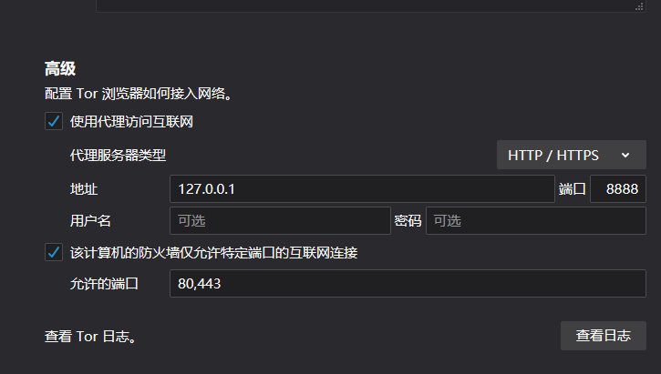
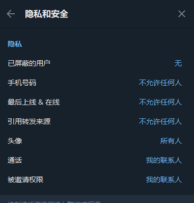

# Privacy-Guide | 隐私指南

>  这是一份写给中国大陆地区 LGBT+ 群体的隐私保护指南

> 注：本项目目前缺少 MacOS / OSX 以及 *UNIX 教程，欢迎提交 PR / issue 补充，在 Github 活动时请注意隐私

> 若您不信任 Github，可以选择在 [喵窝](https://nya.one/) 讨论。讨论板地址为：[URL](https://nya.one/notes/8o6zzr4yni)
>
> 您也可以使用 ProtonMail / Tutanota 联系我，我的邮箱是 [orangexczi@protonmail.com](mailto:orangexczi@protonmail.com)

# 目录

- [软件选择](#软件选择)
  - [浏览器](#浏览器)
  - [搜索引擎](#搜索引擎)
  - [即时通讯软件](#即时通讯软件)
  - [隐私邮箱](#隐私邮箱)
  - [输入法](#输入法)
  - [应用商店](#应用商店)

- [软件使用](#软件使用)
  - [浏览器](#关于浏览器)
  - [即时通讯软件](#关于即时通讯软件)
  - [其他平台](#关于其他平台)

----

## 软件选择

### 浏览器

#### Windows

- [Chrome](https://www.google.cn/chrome/) 

  > Google 在全球分发相同版本的 Chrome 安装包，无需担心“内地特供版”风险

- [FireFox](https://www.mozilla.org/zh-TW/firefox/)

  > FireFox 在中国大陆地区分发和内地企业合作的版本，内地版域名为 [www.firefox.com.cn](https://www.firefox.com.cn/download/) ，**有已知后门，不建议使用内地版，请注意分辨；**

  > 国际版：
  > - [www.mozilla.org（繁体中文）](https://www.mozilla.org/zh-TW/firefox/)
  > - [www.mozilla.org (en-US)](https://www.mozilla.org/en-US/firefox/)

  > - （由于国际版简体中文版本有未经证实的后门，在确认无风险前建议使用繁体中文/英语版本）

- [Tor Browser](https://www.torproject.org/)

  > **使用时请注意，必须设置前置代理。**
  >
  > 
  >
  > 在中国大陆地区直连Tor，无论使用何种方式，都有被喝茶的案例，而且执法机关会明确告知你传唤你是因为使用了Tor，问你是否接触了某些东西。

不要使用一切中资浏览器，包括但不限于360、搜狗、QQ浏览器、UC及其变种。

#### Linux

*多数发行版自带 Firefox ESR，如需更新或换用普通版 Firefox，请自行在终端键入以下命令，或[使用 Mozilla 提供的二进制文件](https://support.mozilla.org/en-US/kb/install-firefox-linux#w_install-firefox-from-mozilla-builds)。您同样可以使用 Flathub 来安装 Firefox，几乎不受发行版限制。*

- Debian/Ubuntu/Linux Mint

<details>

 <summary>点击此处展开</summary>

> 如果您使用 Debian-sid，那么它提供 `apt install firefox` 选项而非稳定版的 `apt install firefox-esr`。您也可以参考 Dibian Wiki 的[这篇文章](https://wiki.debian.org/Firefox)使用其他方式安装 Firefox。

```
sudo install -d -m 0755 /etc/apt/keyrings

# 如果未安装 wget，运行：sudo apt install wget

wget -q https://packages.mozilla.org/apt/repo-signing-key.gpg -O- | sudo tee /etc/apt/keyrings/packages.mozilla.org.asc > /dev/null

gpg -n -q --import --import-options import-show /etc/apt/keyrings/packages.mozilla.org.asc | awk '/pub/{getline; gsub(/^ +| +$/,""); if($0 == "35BAA0B33E9EB396F59CA838C0BA5CE6DC6315A3") print "\nThe key fingerprint matches ("$0").\n"; else print "\nVerification failed: the fingerprint ("$0") does not match the expected one.\n"}'

---- 如果您在键入并回车后看到"The key fingerprint matches"即可进入下一步 ---

echo "deb [signed-by=/etc/apt/keyrings/packages.mozilla.org.asc] https://packages.mozilla.org/apt mozilla main" | sudo tee -a /etc/apt/sources.list.d/mozilla.list > /dev/null

---- 下方为完整代码，请全部复制键入 ----
echo '
Package: *
Pin: origin packages.mozilla.org
Pin-Priority: 1000
' | sudo tee /etc/apt/preferences.d/mozilla
---- 上方为完整代码，请全部复制键入 ----

sudo apt-get update && sudo apt-get install firefox
```

</details>

- ArchLinux/Manjaro

```
sudo pacman -S firefox
```

- Fedora/RedHat

```
sudo dnf install firefox
```

- OpenSUSE

```
sudo zypper in MozillaFirefox
```

您也可以在 [Tor Project 官方网站](https://www.torproject.org/)获取适用于 Linux 各发行版的 Tor Browser 二进制文件。

#### Android&iOS

- FireFox

  - Android
    - [Google Play](https://play.google.com/store/apps/details?id=org.mozilla.firefox)
    - [Mozilla FTP](https://ftp.mozilla.org/pub/fenix/releases/) *1
    - [F-Droid](https://f-droid.org/en/packages/org.mozilla.fennec_fdroid/) *2
   
  > *1：您需要自行寻找最新版本。
  > 
  > *2：此处所提供的版本为 F-Droid 构建，应用名称为 `Fennec` 或 `Fennec F-Droid`，包名为 `org.mozilla.fennec_fdroid`。

  - iOS

    - [App Store](https://apps.apple.com/tw/app/firefox-private-safe-browser/id989804926)

      > 请在下载 FireFox 时使用外区（建议日/美/台/新区）Apple ID，使用内地 Apple ID 会下载到内地版本，已知存在后门

> 注：无论是浏览器还是搜索引擎，不推荐使用 Brave，关于有关其的争议，请查看以下页面
>
> - [Wikipedia](https://en.wikipedia.org/wiki/Brave_(web_browser)#Controversies) | [Archive](https://web.archive.org/web/20210714053937/https://en.wikipedia.org/wiki/Brave_%28web_browser%29)
> - [Community](https://libredd.it/r/privacytoolsIO/comments/gytwmd/brave_browser_privacytoolsio_and_the_negativity/) | [Archive](https://web.archive.org/web/20210531084249/https://libredd.it/r/privacytoolsIO/comments/gytwmd/brave_browser_privacytoolsio_and_the_negativity/)

---

### 搜索引擎

#### 日常

- [Google](https://www.google.com)

  > 关于 Google 确实存在一些争议，但编者认为至少比用百度要尊重隐私。

- [Bing（国际版）](https://www.bing.com/)

  > Microsoft 作为在中国大陆取得运营资格的公司，其可靠性同样值得怀疑。不要忘记使用代理访问！

#### 如果你非常想搜一些作死的东西

- [DuckDuckGO](https://duckduckgo.com/) + 无痕模式

  > 关于DDG存在争议，请使用代理+浏览器无痕模式访问。

- 公共 [SearX](https://searx.me/) 实例
  支持自部署，另有官方列表: [URL](https://searx.space/)，去里面找公共服务器也可用

  > 官方的介绍为，目前认为该程序可信
  >
  > - 自托管
  > - 没有用户跟踪
  > - 没有用户分析
  > - 大约 70 个支持的搜索引擎
  > - 与任何搜索引擎轻松集成
  > - 默认情况下不使用 Cookie
  > - 安全、加密的连接 (HTTPS/SSL)
  > - 由促进数字权利的组织主持，例如 La Quadrature du Net
  >
  > ---
  >
  > 如果您准备自己部署，请注意以下几点：
  >
  > - 不要安装在 **中国大陆地区** 的服务器
  >
  > - 不要安装在 **中国大陆云服务商提供的** 服务器
  >
  > - 不要使用以下 CA / ROOT 提供的证书
  >
  >   - CFCA（China Financial Certification Authority）
  >
  >   - China Internet Network Information Center（China Internet Network Information Center EV Certificates Root）
  >
  >   - ePKI Root Certification Authority（Chunghwa Telecom Co., Ltd）
  >
  >   - Entrust Root Certification Authority
  >
  >   - Entrust Root Certification Authority - EC1
  >
  >   - Entrust Root Certification Authority - G2
  >
  >   - Entrust.net Certification Authority(2048)
  >
  >   - StartCom Certification Authority
  >
  >   - StartCom Certification Authority
  >     StartCom Certification Authority G2
  >
  >   - CA WoSign ECC Root
  >
  >   - Certification Authority of WoSign
  >
  >   - Certification Authority of WoSign G2
  >
  > 
  >
  >   **Ubuntu 和 Kali Linux 不会信任 CNNIC，StartCom，WoSign 证书， 国产安卓会信任**

---

### 即时通讯软件

#### 日常

……~~这咋写，没得写啊，怎么可能不用WXQQ~~

不要使用 WeChat 、QQ 发送有关  **LGBT+** 的内容和其他 **“敏感”信息** 即可

#### 讨论有关 LGBT+ 的活动，以及跨儿之间的 日常 聊天时

- [Telegram](https://telegram.org/) （该标题下所有内容全部需要使用网络代理访问）

  > 该应用需要手机号注册，可以隐藏手机号
  > 可选择 Google Voice 注册

  - Android
    - [官网APK](https://telegram.org/dl/android/apk)
    - [Google Play](https://play.google.com/store/apps/details?id=org.telegram.messenger)

  - iOS
    - [App Store](https://apps.apple.com/app/telegram-messenger/id686449807) （可以使用国区下载）

  - MacOS / OSX
    - [官网下载dmg](https://macos.telegram.org/)
    - [App Store ](https://apps.apple.com/us/app/telegram/id747648890)（可以使用国区下载）

  - Windows / *UNIX
    - [官网](https://desktop.telegram.org/)

- [WhatsApp](https://www.whatsapp.com/?lang=zh_cn)（该标题下所有内容全部需要使用网络代理访问）

  > 该应用需要手机号注册且无法隐藏，不建议和陌生人使用
  > 可选择 Google Voice 注册

  - [Android](https://play.google.com/store/apps/details?id=com.whatsapp)
  - [iOS](http://itunes.apple.com/us/app/whatsapp-messenger/id310633997?mt=8)
  - [MacOS / OSX / Windows](https://www.whatsapp.com/download)

- [Signal](https://signal.org/zh_CN/)（该标题下所有内容全部需要使用网络代理访问）

  直接看官网下载就好

  > 该应用需要手机号注册且无法隐藏，不建议和陌生人使用
  > 可选择 Google Voice 注册

- [Session](https://getsession.org/)（该标题下所有内容全部需要使用网络代理访问）

  - [官网下载页](https://getsession.org/download/)

  > 该软件下载时需要代理，使用时无需网络代理，应用本身是匿名化 ID，无需任何手机号 / 邮箱，聊天时数据三级代理（类似Tor）

- [Element](https://element.io/get-started)（该标题下所有内容全部需要使用网络代理访问）

  > 该应用下载时需要代理，使用时是否需要代理则取决于你所选的消息服务器，一般建议 Matrix.org 的官方服务器（使用时需要代理）
  >
  > 注册时需要邮箱接收验证码，允许使用 ProtonMail 等 隐私邮箱（关于邮箱，会在下个部分写）

> 编者注：
>
> 目前内地很多跨儿还没有找到有效的访问手段，还请在 *确保自身安全的前提下*  给ta们提供一个稳定有效的访问手段
>
> 使用内地IM教别人使用网络代理的风险很大，建议线下教授，或双方均使用隐私邮箱（目前 ProtonMail 和 Tutanota 在内地没有被封锁）

---

### 隐私邮箱

> 实测前两个可以绑定Twitter，第三个没有测试

- [ProtonMail](https://protonmail.com/)

  > 开源
  >
  > 优点：一个台湾人到瑞士成立企业做的隐私邮箱，得益于瑞士法律的保护，数据理论上绝对安全，目前可信（存疑）。
  >
  > 缺点：免费帐户容易封号，2FA只支持 TOTP。
  >
  > 注意：Protonmail 曾被曝在法国黄背心运动中协助法国警察追捕抗议者。讯息来源：[TechCrunch: ProtonMail logged IP address of French activist after order by Swiss authorities](https://techcrunch.com/2021/09/06/protonmail-logged-ip-address-of-french-activist-after-order-by-swiss-authorities/)

- [Tutanota](https://tutanota.com/zh_hans/)

  > 开源
  >
  > 优点：免费帐户很少被封禁，数据中心位于德国，对隐私保护较好，内置密钥算法为 “前向加密”，目前可信，2FA支持 TOTP 和 Fido 硬件密钥。
  >
  > 缺点：新账户48小时内无法收发信;使用 Tor 或代理容易遭到注册限制。

- [Mailfence](https://mailfence.com/)

  > 优点：用户名和邮箱地址可以不同（被社工/爆破风险更低）。
  >
  > 缺点：及其难用。

---

### 输入法

> 远离国产！远离国产！远离国产！

#### PC

- ~~建议原生输入法即可~~
- 推荐使用 [Rime](https://rime.im)
  - Windows: [Weasel (GitHub)](https://github.com/rime/weasel/releases/latest)
  - MacOS: [Squirrel (GitHub)](https://github.com/rime/squirrel/releases/latest)
  - Linux: 推荐使用 `ibus-rime`，各发行版安装见 [Wiki](https://github.com/rime/home/wiki/RimeWithIBus)。

#### Android&iOS

- Gboard

  - Android
    - [Google Play](https://play.google.com/store/apps/details?id=com.google.android.inputmethod.latin)

  - iOS
    - [App Store](https://apps.apple.com/us/app/gboard-the-google-keyboard/id1091700242)（该软件在国区没有上架，需要到外区下载）

#### Android  Only

- [florisboard](https://github.com/florisboard/florisboard)（开源）

  - [D-Droid](https://f-droid.org/packages/dev.patrickgold.florisboard/)

- Fcitx5 for Android（开源）

  - [GitHub Release](https://github.com/fcitx5-android/fcitx5-android/releases/latest)
  - [F-Droid](https://f-droid.org/packages/org.fcitx.fcitx5.android)
  - [Google Play](https://play.google.com/store/apps/details?id=org.fcitx.fcitx5.android)

---

### 应用商店

> 不推荐使用 ApkPure 等第三方应用商店。

- [F-Droid](https://f-droid.org/)
- [Google Play](https://play.google.com/store) 
  (更建议使用前者)
- Aurora Store（Google Play替代品）：[下载链接](https://www.auroraoss.com/downloads/AuroraStore/Release/)

---

### 密码管理器和双重因素认证

#### 密码管理器

- Android: KeePassDX
  - [GitHub Release](https://github.com/Kunzisoft/KeePassDX/releases/latest)
  - [Google Play](https://play.google.com/store/apps/details?id=com.kunzisoft.keepass.free)

- iOS: StrongBox
  - [AppStore](https://apps.apple.com/us/app/strongbox-password-manager/id897283731)
 
- PC: KeePassXC（全平台）
  - [GitHub Release](https://github.com/keepassxreboot/keepassxc/releases/latest)

#### 双重因素认证

> 上述密码管理器同样支持添加双重因素认证（TOTP）。

- Google Authenticator
  - Android
    - [Google Play](https://play.google.com/store/apps/details?id=com.google.android.apps.authenticator2)
  - iOS
    - [App Store](https://apps.apple.com/us/app/google-authenticator/id388497605)

- Aegis (Android)
  - [GitHub Release](https://github.com/beemdevelopment/Aegis/releases/latest)
  - [F-droid](https://f-droid.org/packages/com.beemdevelopment.aegis/)
  - [Google Play](https://play.google.com/store/apps/details?id=com.beemdevelopment.aegis)

- Tofu (iOS)
  - [App Store](https://apps.apple.com/us/app/tofu-authenticator/id1082229305)

## 软件使用

> 首先明确一个观点：不建议以内地平台常用 ID 公开性取向（内外同ID，发在海外平台也不建议）

### 关于浏览器

- 建议开启 DNS-over-HTTPS，详情参考 [/post/doh.md](./post/doh.md)

### 关于即时通讯软件

- WeChat / QQ ：不想炸号就少聊跨性别话题（

- Telegram：

  > *不建议使用 +86，+852，+853注册*

  建议按下图设置 ↓，除此以外，**必须开启两步验证**

  > 

- Signal / WhatsApp：使用 Google Voice / Textnow 注册

  > *不建议使用 +86，+852，+853注册*

- Element：使用隐私邮箱注册

### 关于其他平台

#### Twitter

> 不建议使用 +86，+852，+853注册
>
> 可以使用接码平台注册，注册后follow任意一个帐号，一般会弹出手机号二次验证，验证后可以改绑至  Google Voice

- 开启两步验证：

  > 电脑端：浏览器内打开 https://x.com/settings/security 即可设置
  >
  > 手机端：“设置和隐私” - ”安全性和账号访问权限“ - ”安全“ - ”双重身份验证“

- 发图时注意隐私

  - 聚会拍摄的 Twitter 主页要注意抹除所有人的生日信息
  - 线下见面地点的招牌不建议露出（除非你是去打卡的）
  - 发带有人的照片时，可以使用 Twitter 自带图片编辑器中的表情遮挡面部
    （选择好图片后点确认，在文字编辑状态下点击图片，下方工具栏左数第四个可以添加表情）

- 必要时可以锁推：

  > 电脑端：打开 https://x.com/settings/audience_and_tagging 即可设置
  >
  > 手机端：”设置和隐私“ - "你的账号" - “账号信息” - “受保护的推文”，勾选打开即可

#### BiliBili

>  近期观察到有一些 MtF 群体将 B站 当作朋友圈发，所以添加该板块。

BiliBili 可以使用 Google Voice 注册。

***Silent Wave 特别提醒：如果您未使用全局代理，Bilibili仍然可以获取您的真实 IP 地址。***

#### Google

- Google 并不可信。
